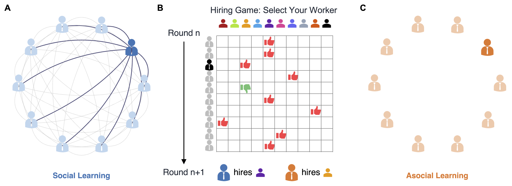

# HiringMAMAB

Code and data for the paper: **[Rational Social Learning Makes Group Hiring More Efficient and Biased](https://osf.io/preprints/psyarxiv/nk632_v2)**

This paper studies how social learning — sharing hiring outcomes across a group — shapes collective decision-making in a multi-agent multi-armed bandit (MAMAB) framework applied to hiring. We show that social learning is a double-edged sword: it accelerates convergence on high-quality candidates (**efficiency gain**) while simultaneously concentrating selections on a narrow set of candidates (**bias increase**). This efficiency–bias tradeoff holds across three types of agents — Bayesian-rational agents, large language models (GPT-4o), and human participants — and reflects a rational, not irrational, consequence of social information sharing.


## Conceptual Overview



*Figure 1. Schematic of the MAMAB hiring task. M agents each independently choose one of N candidates (arms) per round and receive binary success/failure feedback. In the **social (communication)** condition, all agents observe the cumulative outcomes of every agent; in the **asocial (non-communication)** condition, each agent sees only its own history. We measure (i) **bias** — how unevenly selections concentrate across candidates (Shannon entropy, equal-productivity condition, all arms p = 0.9) — and (ii) **efficiency** — how quickly groups converge on the best candidate (optimal arm rate and cumulative reward, unequal-productivity condition).*


## Repository Structure

```
HiringMAMAB/
├── Bayesian/               # Bayesian-rational agent simulations
├── LLM/                    # GPT-4o generative agent simulations
├── HiringProfessionals/    # Human experiment — professional workers
├── Human/                  # Human experiment — student participants
└── figures/                # Publication figures (figure1–4.pdf)
```


## Sub-repositories

### [Bayesian/](Bayesian/)

Implements the normative baseline: agents maintain Beta-distributed beliefs over arm success probabilities and select arms via Thompson sampling (also UCB and ε-greedy). The key manipulation is whether agents share choices and outcomes after each round (social) or act in isolation (asocial).

- `mamab_state.py` — Core simulation: 10 agents × 10 arms, 1,000 rounds, 42 pre-defined initial states
- `mamab_state_AgentArmChange_batch.py` — Scaling experiments (variable agent/arm counts, parallel)
- `process_state_identical.py` — Equal-productivity analysis: entropy trend, OLS regression
- `process_state_different.py` — Unequal-productivity analysis: optimal arm rate, reward improvement
- `data\` - Data and analysis results

### [LLM/](LLM/)

Uses GPT-4o as the agent. Each agent receives a text prompt summarising arm outcomes and responds with its next choice. In the social condition the summary reflects pooled group history; in the asocial condition each agent sees only its own history.

- `mamab_llm.py` — Simulation: unequal-productivity condition
- `mamab_llm_identical.py` — Simulation: equal-productivity condition
- `new_llm_different.py` — Efficiency analysis: four-group cumulative reward bar chart
- `new_llm_identical.py` — Bias analysis: entropy trend and final-round scatter
- `data\` - Data and analysis results

### [Human/](Human/)

Human experiment with participants. Participants play the MAMAB hiring game in groups of 10, completing 50 rounds. Runs on the [Empirica](https://empirica.ly/) platform. 

- `TogetherHire/` — Empirica web app (student version)
- `tools/` — Data analysis code 
- `data\` - Data and analysis results

### [HiringProfessionals/](HiringProfessionals/)

Human experiment with hiring professionals. Same MAMAB paradigm but with participants with previous hiring experience.

- `TogetherHire-Professional/` — Empirica web app (React/Node.js)
- `tools/` — Data analysis code
- `Survey/` — University familiarity and quality rating experiments
- `data\` - Data and analysis results


## Key Findings
This study shows that both outcomes (efficiency and bias) can arise from the same process: **rational social learning**. When decision-makers see what others have already discovered in the same context, they can quickly figure out the best option. However, it also reduces exploration, increasing the risk of biased decisions.


## Dependencies

Each sub-repository has its own `README.md` with installation instructions. Common dependencies:

```bash
pip install numpy scipy matplotlib pandas statsmodels seaborn joblib openai
```

